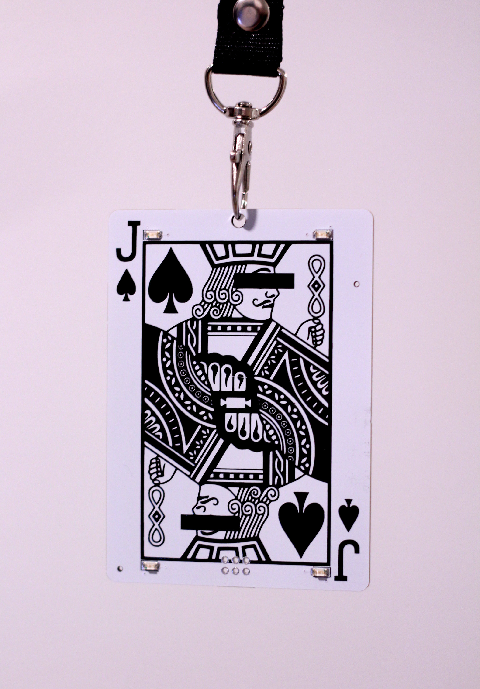

# Playing Card Badge

This repo contains the firmware for a badge I designed and sold at WWHF Mile High 2025. It turned out pretty sick and I'm very proud of the project :)

    

## Usage

### Controls 

* Press button to switch animation
* Hold down button for 1 second to put device asleep
* Hold down button for 1 second to wake device back up 

When the device is in deep sleep it should consume very very little current, but if putting the device into storage I recommend removing the battery just to prevent corrosion.

### Other Info

**IMPORTANT NOTE:** In some extended testing I found there is a bug that causes the badge to turn off on its own after several hours. If this happens to your badge, all you need to do is remove and reinsert the battery and it will turn back on. Apologies for this, if I later find the cause and it is in firmware, I will include extensive documentation on how to reflash the badge to fix it.

* Before first use, battery should be loose in bag with badge, find it and insert it into the badge
    * Insert with positive side of battery facing up (aka away from the badge)!
* Badge takes 1xCR2032 battery
* Large contacts on the back are protected from short circuits, but I still recommend avoiding metal bridging contacts on the board if possible
* Inside the bag should be a 2x3 pin header, this can be soldered to the badge to convert it to an SAO, allowing it to be connected to any SAO supporting parent badge
    * Follow the orientation marked on the silkscreen to ensure that your badge is correctly oriented (gap on silkscreen matched to gap in header shielding).

# Development

The main microcontroller on the board is an ATtiny402, and the firmware is written for the [megaTinyCore](https://github.com/SpenceKonde/megaTinyCore) Arduino core. 

Pin assignments (using megaTinyCore pin notation) are as follows:

| Name | Pin Number | Notes |
|- | - | - |
| Button | 0 | Should be pulled high |
| LED Top Left | 3 | | 
| LED Top Right | 4 | | 
| LED Bottom Left  | 2 | | 
| LED Bototm Right | 1 | | 

As the microcontroller is very flash limited, a bootloader is not used. More informating about the ATtiny402 and megaTinyCore can be found [here](https://github.com/SpenceKonde/megaTinyCore/blob/master/megaavr/extras/ATtiny_x02.md).

### Flashing

The board is flashed over UPDI, by default, high voltage is not enabled so a normal serial adapter can be used to program the device. More information on adapting your serial adapter to be used with UPDI can be found in the [megaTinyCore documentation](https://github.com/SpenceKonde/AVR-Guidance/blob/master/UPDI/jtag2updi.md).

Attach your UPDI programmer, 3V, and ground to the board through the alligator clip contacts on the back to program the device, the `platformio.ini` file may need to be modified for your specific programmer, but the present configuration should work for most common serial programmers.

## Final Notes

I am writing much of this right before WWHF, so sorry if some if it is a bit messy. Thank you so much for checking out the project, and an even bigger thanks if you bought one of the badges.
